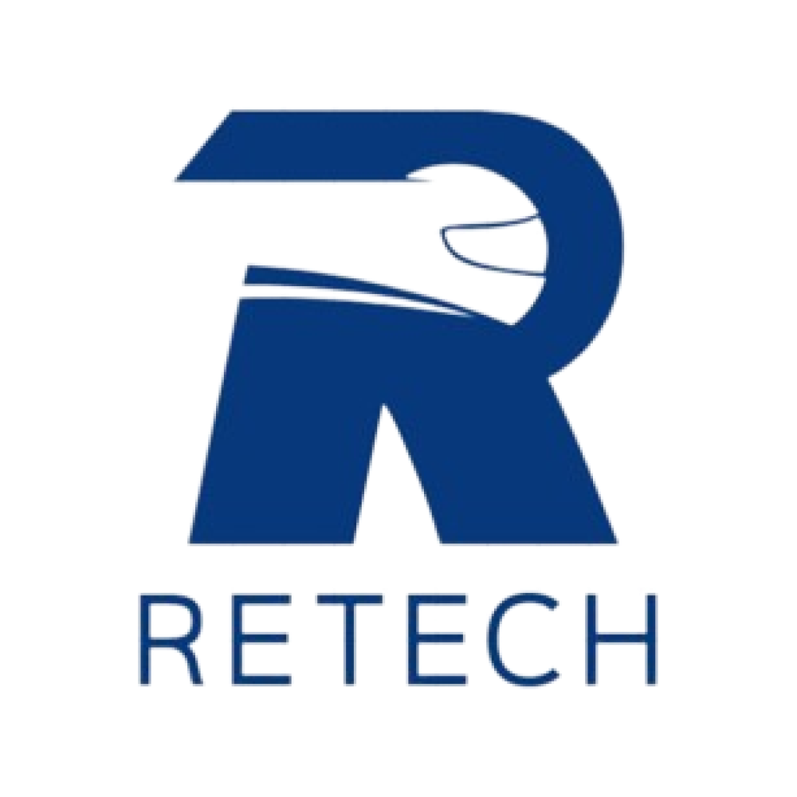

# Retech - Sustainable Repair and Recycling Platform

## Description

Retech is a Sustainable Repair and Recycling Platform that Supports Electronics and Vehicle Management. The platform is designed to help users manage their electronics and vehicles in a sustainable way. The platform provides users with the ability to track the repair and recycling of their electronics and vehicles, as well as the ability to find repair and recycling services in their area. The platform also provides users with information on how to properly dispose of their electronics and vehicles, as well as information on how to repair and recycle them. The platform is designed to be user-friendly and easy to use, with a clean and simple interface that is easy to navigate. The platform is also designed to be environmentally friendly, with a focus on sustainability and reducing waste. The platform is designed to be a one-stop shop for all of your electronics and vehicle repair and recycling needs.

## Features

- Track the repair and recycling of your electronics and vehicles
- Find repair and recycling services in your area
- Get information on how to properly dispose of your electronics and vehicles
- Get information on how to repair and recycle your electronics and vehicles
- User-friendly and easy to use interface
- Clean and simple design
- Environmentally friendly
- Focus on sustainability and reducing waste
- One-stop shop for all of your electronics and vehicle repair and recycling needs

## Technologies Used

- Flutter
- Gin
- PostgreSQL
- Docker
- etc.

## Installation

1. Clone the repository
2. Install the required dependencies
3. Run the application

## Usage

1. Sign up for an account
2. Log in to your account
3. Track the repair and recycling of your electronics and vehicles
4. Find repair and recycling services in your area
5. Get information on how to properly dispose of your electronics and vehicles
6. Get information on how to repair and recycle your electronics and vehicles

## Contributors

- Adzin Zhalifunnas - 2602063144
- Bryan Liem - 2602054865
- Raymond Willen Kristopo - 2602054751
- Dylan Goliat - 2602090063

## Acknowledgements

- Special thanks to our lecturer, Mr. Syaeful Karim, for his guidance and support throughout the project.
- Special thanks to our classmates for their feedback and suggestions.
